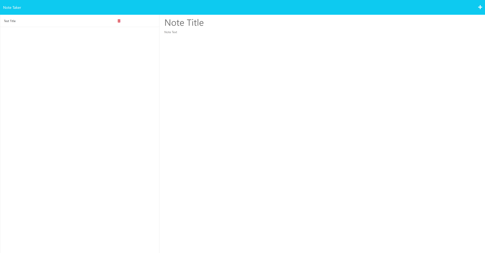

# Note Taker 

## Description
In challenge eleven we were asked to create a note taker that would add and delete notes that are stored in the database. You can click the existing notes to see what is in that note.
## Table of Contents
1. [Install](#install)
2. [Usage](#usage)
3. [Contribution](#contribution)
4. [License](#license)

## install
N/A

## usage
click the link here to the deployed page: https://marvinblunck.github.io/NoteTaker/

To use the note taker add a note by clicking the plus sign and fill out anything that you would want in it. Then hit the save button in the top right, and you can click the trashcan to delete it when you are done with it.

This is the preview of the page:

## contribution
Andrew Hardemon helped fix most of my code and helped explain helpers.

## license
MIT